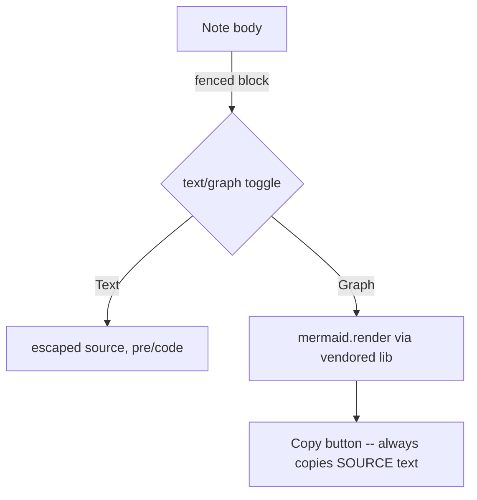

# Note media — one example per supported entity type

Live demo AND feedback record for neural-view's note media (PR#288). Paths are relative to this brain's directory; served read-only via `/file/`, extension-allowlisted.

## Images — `` embeds inline; click opens the media viewer

Local PNG: 

Remote image (http/https passes through untouched): 

Supported image extensions: `.png .jpg .jpeg .gif .webp .svg`

## Video — `[label](path.mp4)` becomes an inline player

[Sintel trailer](assets/demo/demo.mp4)

Supported: `.mp4 .webm .mov` (local files only — remote video links open as plain external links)

## 3D models — `[label](path)` becomes a live rotating viewer

GLB (vendored GLTFLoader): [Khronos duck](assets/demo/duck.glb)

OBJ (hand parser): [pyramid](assets/demo/pyramid.obj)

STL (hand parser, binary or ascii): [cube](assets/demo/cube.stl)

Supported: `.glb .gltf .obj .stl`

## Audio — `[label](path.wav)` becomes an inline player

[Test tone](assets/demo/demo-audio.wav)

Supported: `.mp3 .wav .ogg .m4a` (same New tab/Save to/Detach chrome as the 3D block; detaches into its own window like every other media type)

## Diagrams — fenced ```mermaid``` blocks render as a toggleable graph



Text/graph toggle, copy-source button, and Detach all match the other media types' chrome.

## Plain files — `[label](path)` opens raw in a new tab

[demo.txt](assets/demo/demo.txt) — also `.md .json .pdf`

## Other link types

External link (opens in new tab): [glTF sample models](https://github.com/KhronosGroup/glTF-Sample-Models)

Wikilink to another note in this brain: [[bisect-before-blaming-tracked-flakiness]]

## Feedback from building this demo

- Everything above embeds with plain markdown — no special syntax beyond `` vs `[]()`.
- Video/3D embeds hang off ordinary links, so the note stays readable as raw markdown in any editor.
- Local ffmpeg was broken (missing x265 dylib), so the video sample is a fetched file — the feature never needs transcoding, any browser-playable file works.
- Remote video does NOT inline (only local files do); remote images DO. Asymmetry is deliberate for now.
- The audio fixture is a generated 1s 440Hz sine (stdlib `wave`, deterministic) — no network fetch, no ffmpeg, mirrors the transcoding lesson above.
## Feedback addendum: this demo caught a real bug — code-span examples (``) were parsed as live media; fixed in sw/neural-view-synapse-clicks by protecting backtick spans in render_body.

## 3D CAD — `[label](path.scad)` renders the MODEL first; Code toggles the source

OpenSCAD duck (subset-friendly — also opens in real OpenSCAD: F6, then Export as STL):

[duck.scad](media/duck.scad)

The preview interprets the printable-primitive subset (`sphere`, `cube`, `cylinder`, `translate`/`rotate`/`scale`, `union`, `color`) directly into the live viewer — same Spin/Detach/Save chrome as the other 3D blocks, plus a Code toggle. A `.scad` using unsupported ops (`difference`, modules, variables) falls back to the highlighted source view instead of rendering wrong geometry.

Fenced ```scad blocks in notes and chat get the same 3D-first treatment when they fit the subset:

```scad
$fn = 32;
union() {
    cylinder(2, 8, 8);
    translate([0, 0, 2]) cylinder(6, 5, 1.2);
    translate([0, 0, 9]) sphere(2.2);
}
```
