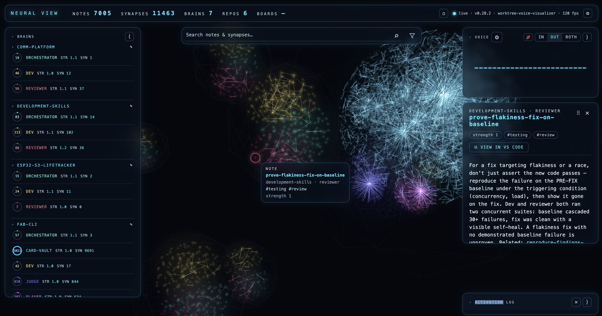
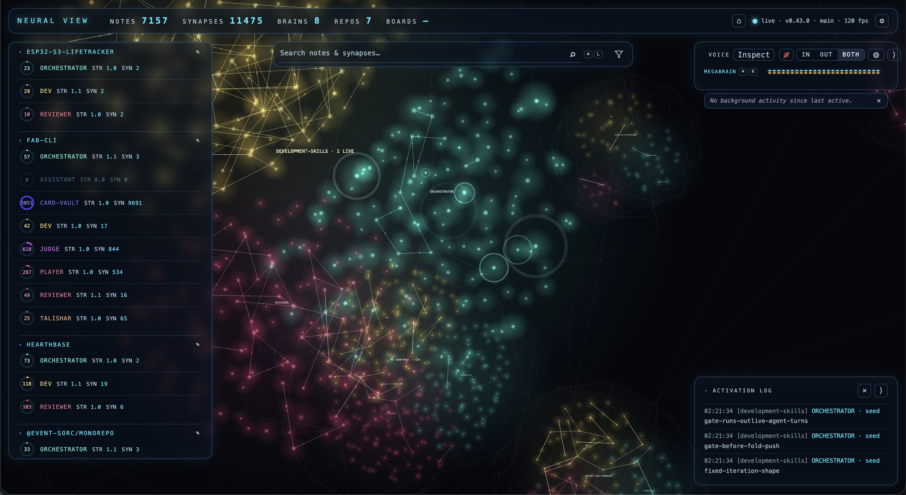
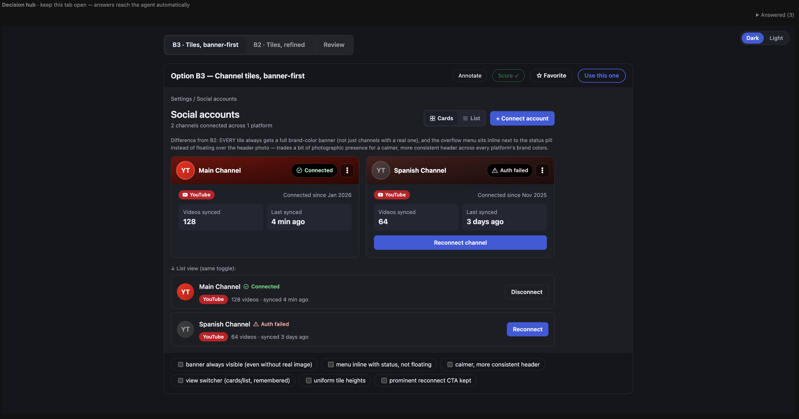
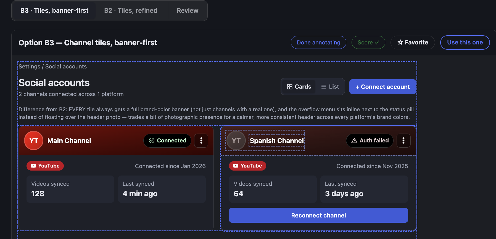
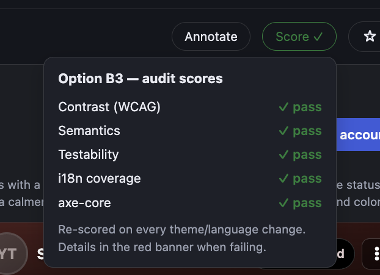

# development-skills

A [Claude Code plugin marketplace](https://docs.claude.com/en/docs/claude-code/plugin-marketplaces) of development-workflow plugins.

## Install

```bash
claude plugin marketplace add Zugruul/development-skills
claude plugin install spec-workflow@development-skills
```

Or per-repo (shared with everyone opening the repo) via `.claude/settings.json`:

```json
{
    "extraKnownMarketplaces": {
        "development-skills": {
            "source": { "source": "github", "repo": "Zugruul/development-skills" }
        }
    },
    "enabledPlugins": { "spec-workflow@development-skills": true }
}
```

## Tooling

### Neural View



Visualization of "brains" that help guide development and knowledge base over each project. With help of RAG in addition to semantic search we are able to probe it for information.

### Live activations — watch the memories fire



When an agent recalls a lesson, you see it happen. Every `brain.sh recall` an
orchestrator runs — while briefing a dev agent, reviewing a diff, or answering
a question — emits activation events, and the neural view renders them the
moment they occur:

- **Expanding rings** pulse around the exact notes being accessed, right where
  they sit in their repo's cluster — in the screenshot, a live
  `development-skills` session is seeding three orchestrator memories and the
  ripples radiate out from each one.
- **The activation log** (bottom right) narrates the same events as text:
  timestamp, repo, role, event kind, and the note's slug — so a glowing neuron
  is never anonymous.
- **Spreading activation is visible too**: after the seeded notes light up,
  energy flows along their synapses to related notes (the `hop` events), which
  is literally the recall ranking algorithm drawing itself.
- **Live session markers** (`· 1 LIVE` next to a repo name) show which brains
  currently have an agent thinking against them.

Nothing is replayed or simulated — the page tails each brain's
`.activation.jsonl` feed, so what you're watching is the actual memory traffic
of agents working, as it happens. Leave it on a second monitor and you can
tell at a glance *what the loop is thinking about* without reading a single
transcript.

### UI Mode





Allows quick iterations over UI before its implementation. With i18n and theming support. Also supports a11y checks to ensure that you are delivering the best accessibility and testability possible as well. 

### Remote compute

Use another machine as compute. You register a machine once, then send jobs to
it over SSH from wherever you work.

- Key-based SSH only. The skill never asks for or stores a password.
- Jobs run detached. They keep running if your session ends.
- Tools like ComfyUI are **capability bundles** — data, not code. Adding a new
  one never means changing the skill.

Example: a Windows laptop with WSL2 and an RTX 5090 runs ComfyUI. You drive it
from a Mac.

#### 1. Set up the machine (once)

On the Windows/WSL side:

- Leave ComfyUI on its own loopback address. Never start it with `--listen 0.0.0.0`.
- Install SSH in WSL: `sudo apt install -y openssh-server && sudo systemctl enable --now ssh`
- Put `networkingMode=mirrored` in `%UserProfile%\.wslconfig` so WSL shares the
  laptop's LAN IP.
- Give the laptop a DHCP reservation so its IP stops moving.

Run `remote-compute setup-sheet wsl2` to print this list. Linux and macOS have
their own sheets. If a check fails during registration, the matching sheet is
printed automatically.

#### 2. Export the workflow from ComfyUI

Build the workflow as usual, then choose **Workflow → Export (API)**. On older
builds, turn on Settings → Dev mode first, then use **Save (API Format)**.

This matters: the normal save is a picture of the canvas, and ComfyUI's API
refuses it. The API export is the executable form. Pass the wrong one and the
skill says so and tells you how to fix it.

#### 3. Register the machine

```bash
/remote-compute register example-remote-machine-name your-user@machine-lan-ip
```

Replace `your-user` with the username on that machine, and `machine-lan-ip`
with its address on your network. To find the address: `ipconfig` on Windows
(use the Wi-Fi or Ethernet IPv4, not a `vEthernet` one), or `ifconfig` on macOS
and Linux. The name in front is yours to pick; it becomes the SSH alias you use
from then on.

Registration is safe to re-run. Each run re-checks the SSH alias, key access,
the pinned host key, the hardware probe, and the remote job folder.

If something is missing, it stops and tells you what to do — the exact
`ssh-copy-id` command when keys aren't set up, or the host key fingerprint to
confirm before it is trusted.

When it succeeds, you see what was actually measured on the machine:

```
REGISTERED example-remote-machine-name (your-user@machine-lan-ip)
  os:     windows-wsl2
  gpu:    NVIDIA GeForce RTX 5090 Laptop GPU  vramMB: 24463  cuda: 13.3  driver: 610.62
  ramGB:  94        (ramScope: wsl2-vm — what WSL can use, not the 192GB host)
  disk:   /            freeGB: 876
  disk:   /mnt/c       freeGB: 720     (slow: DrvFs/9p)
```

Nothing here is assumed. Every value comes from a real command on the machine,
and anything that can't be read is recorded as an error instead of a guess.

#### 4. Add ComfyUI support and make the machine available

```bash
/remote-compute install-capability example-remote-machine-name plugins/spec-workflow/scripts/remote-capabilities/comfyui
/remote-compute enable example-remote-machine-name --role render
```

`enable` says "this project can use that machine". It does not reserve it —
several projects can use the same machine, and a lock keeps jobs from
colliding.

Availability is saved to `.claude/project.local.yaml`, which is gitignored. The
machines you can reach depend on your hardware, not on the repository, so this
never gets committed. No hostname, username, or secret goes into the repo.

#### 5. Generate

Declare the job once, connecting your workflow's nodes to named parameters:

```bash
/remote-compute add-job example-remote-machine-name generate-image-v1 \
  --workdir '~/.compute-jobs/_tools' \
  --cmd "python3 ~/.compute-jobs/_caps/comfyui/comfy-run.py \
         --workflow '/mnt/c/ComfyUI/user/default/workflows/generate-image-v1-api.json' \
         --port 8000 --set 40.text={positive} --set 39.text={negative} \
         --set 36.value={seed} --set 29.filename_prefix={prefix}" \
  --param 'seed:[0-9]+' --param 'positive:[^`$;|&<>]+' \
  --param 'negative:[^`$;|&<>]+' --param 'prefix:[^`$;|&<>]+'
```

Then run it by name, as often as you like:

```bash
/remote-compute run example-remote-machine-name generate-image-v1 \
  --param seed=846151159261372 \
  --param 'positive=masterpiece,best quality,1girl,white hair' \
  --param 'negative=bad quality,watermark,text' \
  --param 'prefix=demo/'

/remote-compute job-status <id>
/remote-compute job-pull <id> --dest ./out
```

For a batch, loop the `run` command with a different seed each time.

The job starts in a tmux session on the machine and writes its log, process id,
and exit code to disk. If your session dies, `job-status` picks the job back up
from those files.

#### What the skill guarantees

- **Your workflow is never rewritten.** Only input values change. The graph
  itself is left exactly as you built it.
- **Bad values fail fast.** Parameters are checked against the patterns you
  declared, and choices like `ckpt_name` or `sampler_name` are checked against
  the server before anything is queued. A wrong model name comes back in
  milliseconds, listing the models that do exist.
- **No sudo, ever.** Not locally, not remotely. Anything needing admin rights is
  printed for you instead.
- **One job at a time**, unless you raise `maxConcurrentJobs`. Two agents
  sharing a GPU can't trip over each other.

#### Adding more

A second ComfyUI machine is the same four commands with a new name. The bundle
works on any machine, so nothing needs to change.

A different kind of work — a training box with torch and unsloth, say — is a new
bundle plus one command:

```bash
/remote-compute add-env example-remote-machine-name training \
  --activate 'source ~/.venv/bin/activate'
```

That checks the environment right away and records what it found, so the
registry reflects what is really installed.

## Update

Pull the latest skills from this repo at any time:

```bash
claude plugin marketplace update development-skills
```

or open `/plugin` in Claude Code and use **Update now** on the `development-skills` marketplace.

## Codex support (in progress)

Dual-host support for [OpenAI Codex](https://developers.openai.com/codex) is landing incrementally — `spec-workflow` and `scaffold-project` already ship a `.codex-plugin/plugin.json` and are installable from a repo-local `.agents/plugins/marketplace.json`, and an end-to-end smoke test proves a real Codex session can discover and run an installed skill. A Codex-side agent working in this repo should start at [`AGENTS.md`](AGENTS.md) for orientation (Claude Code reads [`CLAUDE.md`](CLAUDE.md), a one-line pointer to the same file). Full install/invocation docs for Codex, a per-host compatibility matrix, and CI coverage are tracked in [`docs/BACKLOG-CODEX-COMPAT.md`](docs/BACKLOG-CODEX-COMPAT.md) (epics E1–E4) and will land here once that work ships — `.claude/` remains the canonical, always-supported host in the meantime.

## Assistant observability (in progress)

The in-repo assistant (`SPEC-ASSISTANT.md`) records every turn as an event in a
per-repo, gitignored `.claude/assistant/traces.sqlite` (append-only, WAL mode).
Retention is pruned automatically by a single background writer thread, oldest
events first, configured per repo via `assistant.observability.traces.sqlite`
in `project.yaml`:

```yaml
assistant:
  observability:
    traces:
      sqlite:
        retainDays: 30   # delete events older than N days; 0 = unlimited
        maxMB: 500        # trim oldest events until the file is under N MB; 0 = unlimited
```

Both knobs default to `30`/`500` when omitted. Retention only ever touches
`traces.sqlite` — it never deletes the embeddings index, `session.jsonl`, or
any other local-state file. Full observability epic tracked in
[`docs/design/ast-E4.md`](docs/design/ast-E4.md).

Memory access is fully observable too — see
[Live activations](#live-activations--watch-the-memories-fire) under Tooling
for the real-time view of recalls lighting up the network.

## Testing

```bash
bash plugins/spec-workflow/tests/run-tests.sh    # hermetic: validator fixtures + preflight (CI runs this + shellcheck + manifest validation)
claude plugin eval plugins/spec-workflow         # skill evals (early access; needs API credits)
```

The evals exercise the skills on real models — including smaller ones (`--model sonnet`) —
to keep them simple-model-proof.

## Local development

To hack on the skills, point the marketplace at your clone instead — with a
`directory` source, skill edits reach new sessions immediately (no version bump):

```bash
claude plugin marketplace remove development-skills
claude plugin marketplace add /path/to/development-skills
```

## Plugins

### spec-workflow

Spec-driven autonomous build workflow. A repo declares its boards, specs, epics, guards, gate command, delegation roster, and conventions in a **versioned YAML config** (`.claude/project.yaml`, schemaVersion 2 — schema in `plugins/spec-workflow/schemas/`, wired for editor hover/autocomplete via a `# yaml-language-server` modeline; needs PyYAML); the plugin's skills and scripts read that config through one shared loader, so the same workflow drives any project. A legacy `.claude/project.json` (schemaVersion 1) is still read and auto-converted (deprecated).

| Skill | Purpose |
|---|---|
| `craft-spec` | Assisted spec creation: interview → draft → review → backlog |
| `setup-project` | Bootstrap a repo: config, GitHub Project board, validation |
| `setup-assistant` | Scaffold a bare-brain assistant repo (marker, project.yaml assistant section, brain dirs, persona AGENTS.md, gitignores) and edit its settings |
| `seed-board` | Create issues + board items from a spec's backlog (idempotent) |
| `board` | All board reads/writes (single script, no hardcoded ids) |
| `next-task` | Prioritized + sequenced + guarded pick; reads human comments |
| `queue` | Read-only view of the upcoming build-next picks, priority-first, with blocked reasons |
| `find-task` | Ranked search of existing board issues by title/body similarity (dedup) |
| `create-inbound` | Search-first, dedup-gated capture of ad-hoc ideas/bugs/requests onto the board |
| `implement-task` | One task via TDD, delegated to a dev subagent with a what/how/why brief |
| `ui-options` | Iterative UI mode: human picks the UI from an options page (favorite + aspects) |
| `gate` | The project's single green-before-advance quality command |
| `build-next` | One full loop iteration — drive with `/loop /spec-workflow:build-next` |
| `brain` | Per-identity zettel memory: private brains, spreading-activation recall, retro mint/prune/graduate |
| `auto-merge` | Toggle autonomous PR review + merge (reviewer agent approves instead of a human) |
| `pr-review-model` | Show/set the model the autonomous PR reviewer runs on |
| `agent-identities` | Per-role commit attribution — each person's clone signs agent commits with their own plus-addressed email |
| `concurrency` | Show/set `methodology.maxInProgress` — sequential (default) vs N parallel implementation lanes |
| `checkpoint` | Pause/resume the loop via a local flag file |
| `handoff` | Session/pause handoff document |
| `dev-up` | Bring up the project's dev stack for QA |
| `neural-view` | Live JARVIS-style visualization of the identity brains — notes as neurons, recalls lighting up in real time |
| `feedback` | Structured per-iteration process feedback about the workflow itself (`methodology.feedback`); triaged into backlog/brain-note/graduate/upstream/ignore at retro time |
| `sync-project-configs` | Discover every anchored repo and bring its `.claude/project.yaml` up to the plugin's current config surface via versioned sync rules; dry-run by default |
| `remote-compute` | Register remote machines (SSH, key-only) as user-level compute resources; enable their availability per project (gitignored local overlay, non-exclusive); declared jobs for dispatch-by-intent (e.g. ComfyUI from a pre-authored workflow), exec/lock/dispatch with file-recoverable job state |
| `changelog-generate` | Fully regenerates `CHANGELOG.md` from git history, versioned by `plugin.json`'s semver windows and grouped by conventional-commit type; idempotent, kept fresh on every push to `main` by a GitHub Action |

Humans steer the loop by commenting on task issues: `next-task`/`implement-task` read every comment before starting, fold accepted changes into the issue's acceptance criteria, and reply on the issue.

### scaffold-project

Scaffolds a new greenfield project's minikube dev-workflow scripts
(start/stop/dev/build/port-forward/bootstrap) into a `scripts/` folder, with
`package.json` wired to run them.

| Skill | Purpose |
|---|---|
| `scaffold-project` | Generate a project's minikube dev-workflow scripts from templates, every profile bound explicitly (`MK_PROFILE`, never minikube's shared default) so scaffolded projects never collide with each other |

```bash
claude plugin install scaffold-project@development-skills
```
